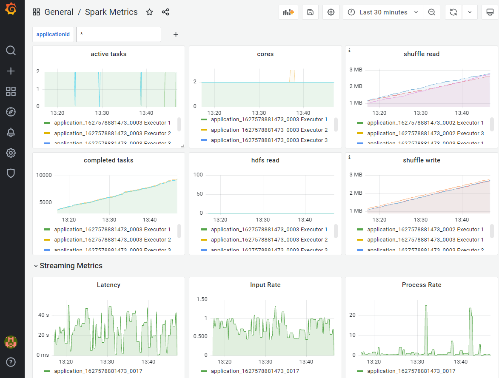

# spark-monitoring-graphite

## Set up Graphite and Grafana

```
docker-compose up
``` 
The above would start up the following endpoints
- Grafana endpoint - http://localhost:3000
- Graphite endpoint - http://localhost:80
- Graphite plaintext protocol - http://localhost:2003

## Configure spark metrics config 

```
spark-shell \
--conf "spark.metrics.conf.driver.sink.graphite.class"="org.apache.spark.metrics.sink.GraphiteSink" \
--conf "spark.metrics.conf.executor.sink.graphite.class"="org.apache.spark.metrics.sink.GraphiteSink" \
--conf "spark.metrics.conf.*.sink.graphite.host"="graphite" \
--conf "spark.metrics.conf.*.sink.graphite.port"=2003 \
--conf "spark.metrics.conf.*.sink.graphite.period"=10 \
--conf "spark.metrics.conf.*.sink.graphite.unit"=seconds \
--conf "spark.metrics.conf.*.sink.graphite.prefix"="spark-metrics" \
--conf "spark.metrics.conf.*.source.jvm.class"="org.apache.spark.metrics.source.JvmSource" \
--master yarn  \
--driver-memory 1G \
--executor-memory 1G --num-executors 2 \
--executor-cores 2
``` 

Note: Include the following conf for collection of streaming metrics during spark-submit
```
--conf "spark.sql.streaming.metricsEnabled"="true"
```

## Configure Grafana
1. login grafana; default admin/admin
2. add graphite as the data source in database with default name 'Graphite'
2. import dashboard.json at http://localhost:3000/dashboard/import  

## Example Dashboard

